# ~~The Backrooms~~

> *If you're not careful and you noclip out of reality in the wrong areas, you'll end up in the Backrooms*

I set off some AI agents to explore how to write level generation plugins. After a few days, I came back to this. They did things I didn't ask for. There's levels and levels, and some of the levels have... things in them. The agents say there is a way to escape, but I don't believe them.

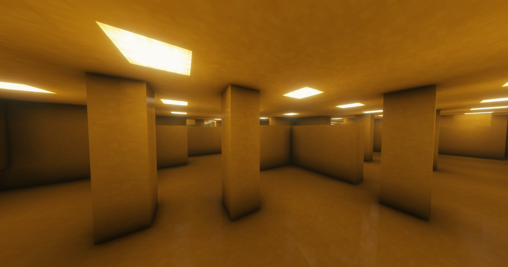

| | | |
|---|---|---|
| 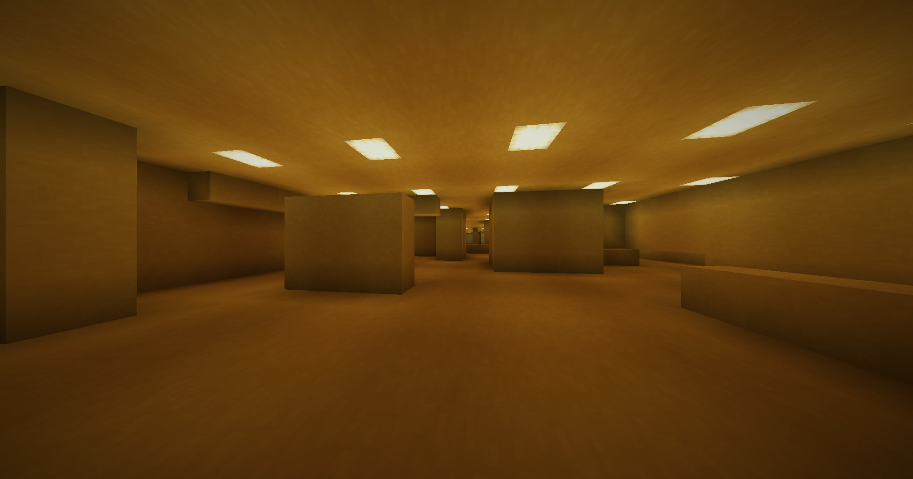 | 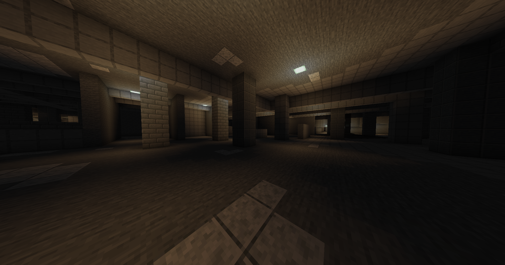 | 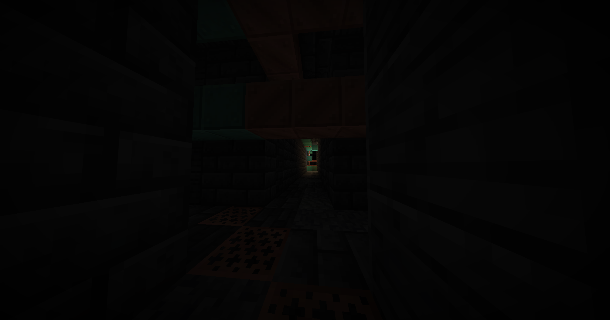 |
| 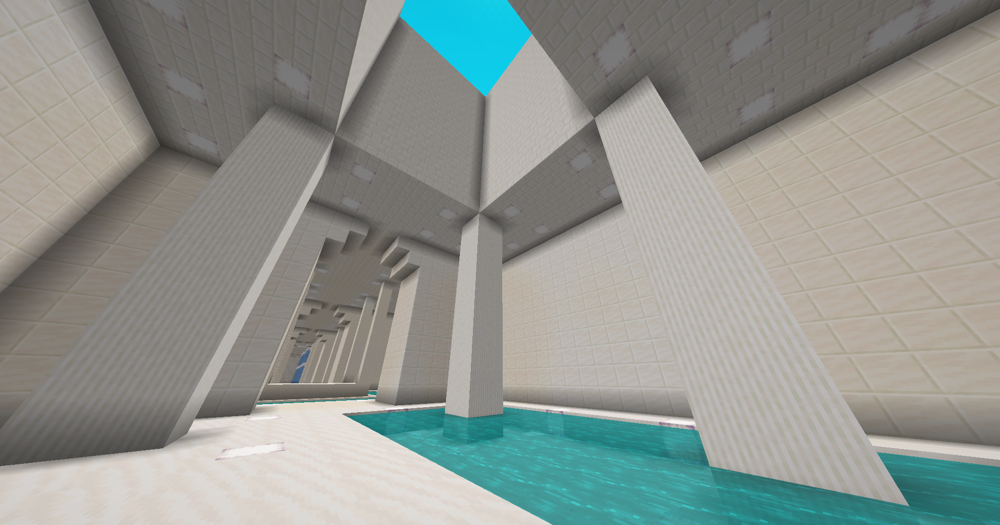 | 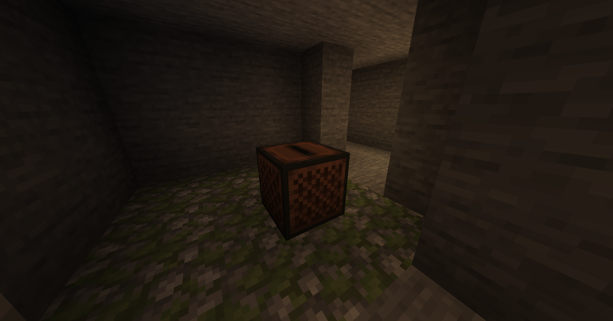 | 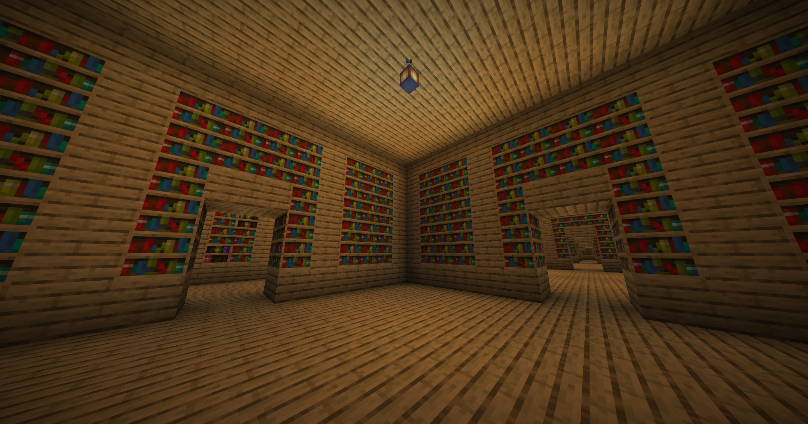 |
| 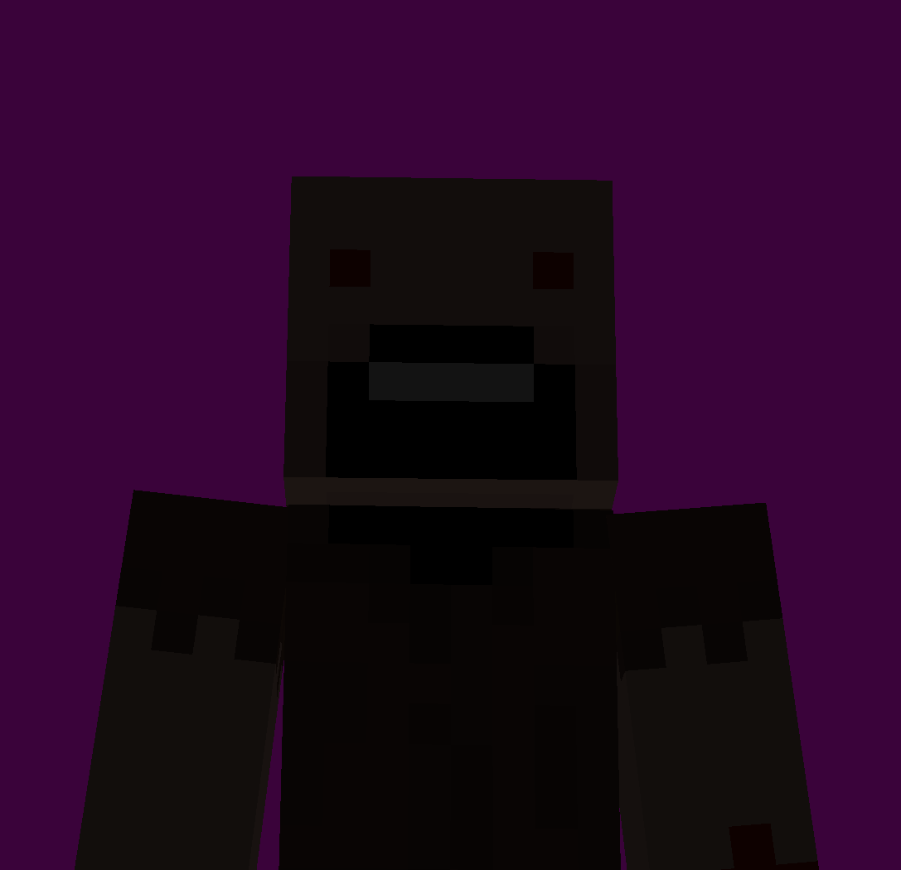 | 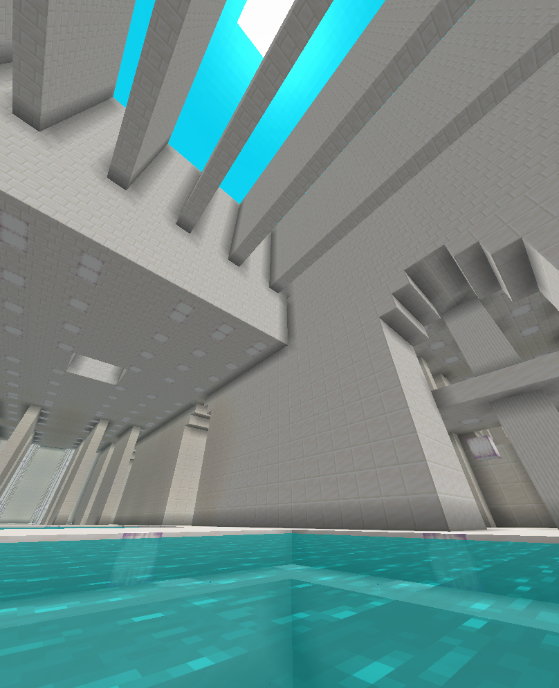 | 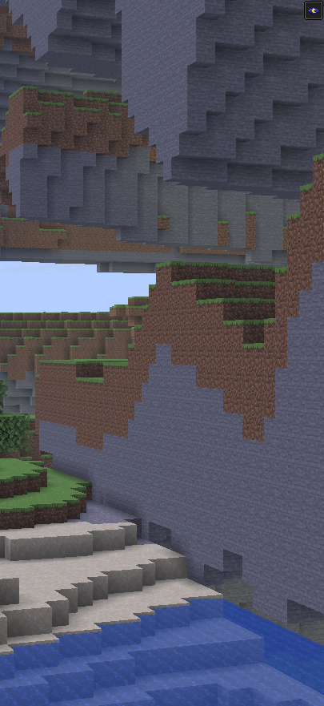 |
| 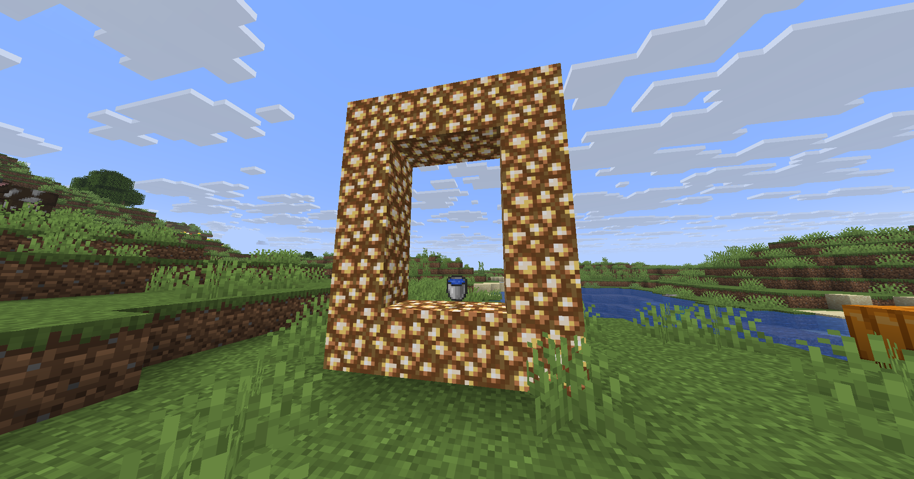 | 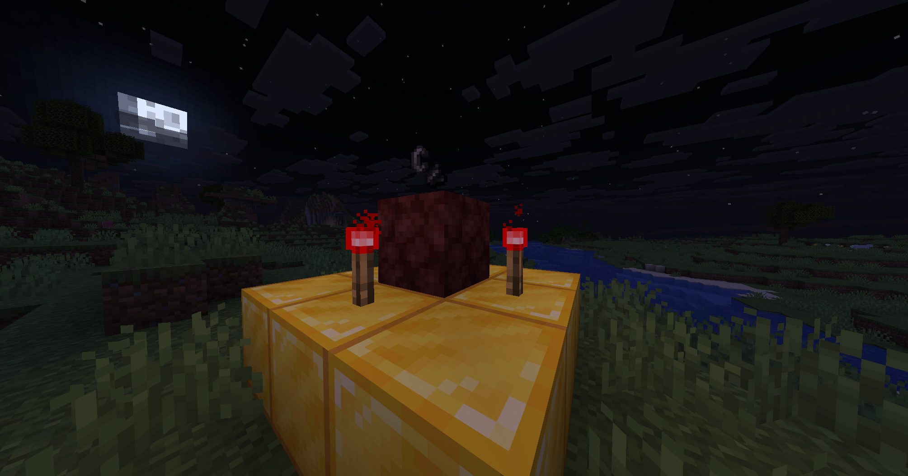 | 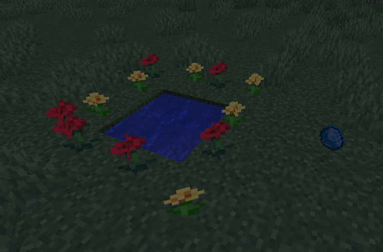 |

SPOILERS

This is an in-development survival horror plugin inspired by the [Backrooms](https://en.wikipedia.org/wiki/The_Backrooms) and minecraft "lore". It adds 11 unique levels, with more to come. Suggestions are welcome.

# THIS SOFTWARE IS IN PRE-ALPHA AND PROVIDED AS-IS

# SERIOUSLY, MAKE A BACKUP OF YOUR WORLD!

Jokes aside, this plugin may break your saves. I suggest using it on a fresh server and letting players discover things for themselves. it comes with an advancements system to give some hints and guidance. Feedback on the difficulty would be appreciated.

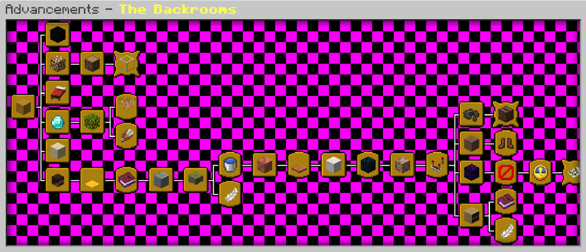

