# ~~The Backrooms~~

> *If you're not careful and you noclip out of reality in the wrong areas, you'll end up in the Backrooms*

I set off some AI agents to explore how to write level generation plugins. After a few days, I came back to this. They did things I didn't ask for. There's levels and levels, and some of the levels have... things in them. The agents say there is a way to escape, but I don't believe them.

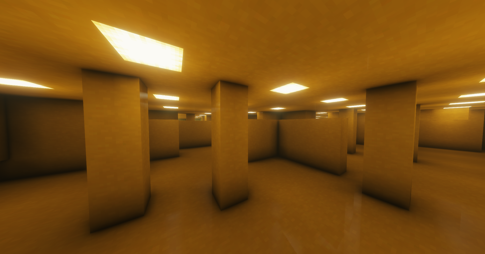

| | | |
|---|---|---|
| 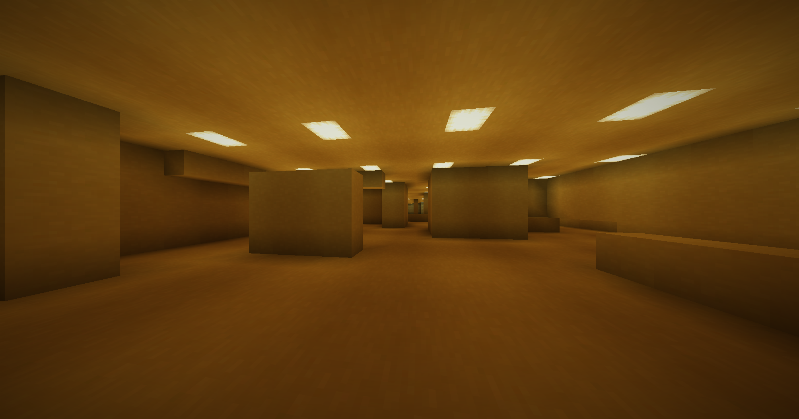 | 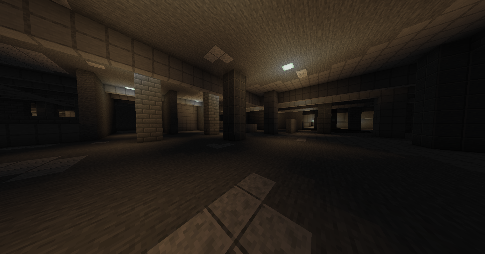 | 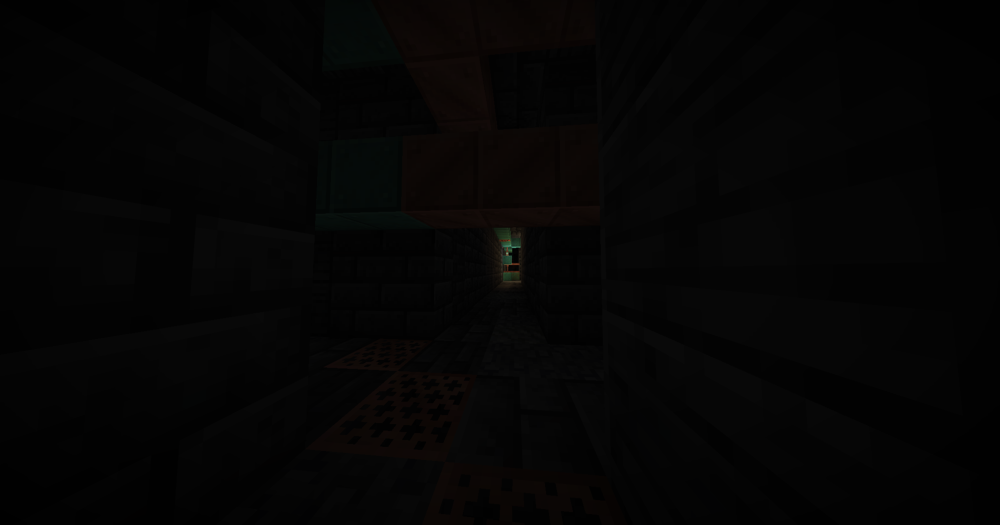 |
| 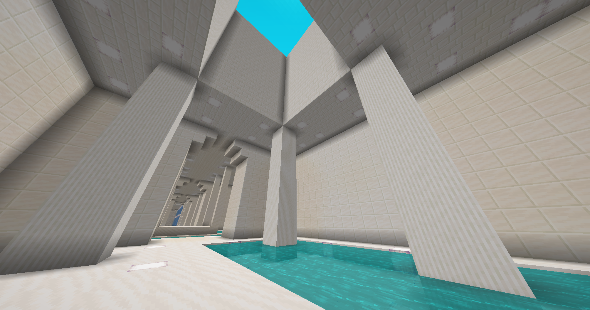 | 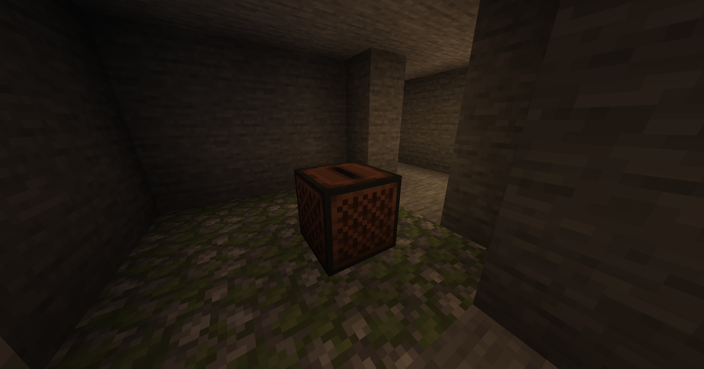 | 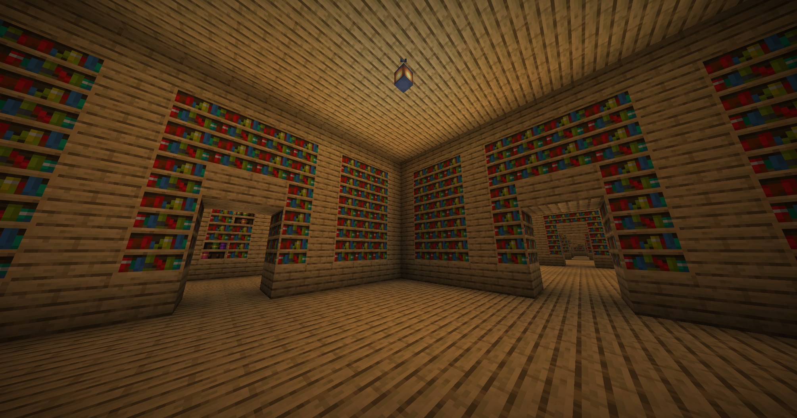 |
| 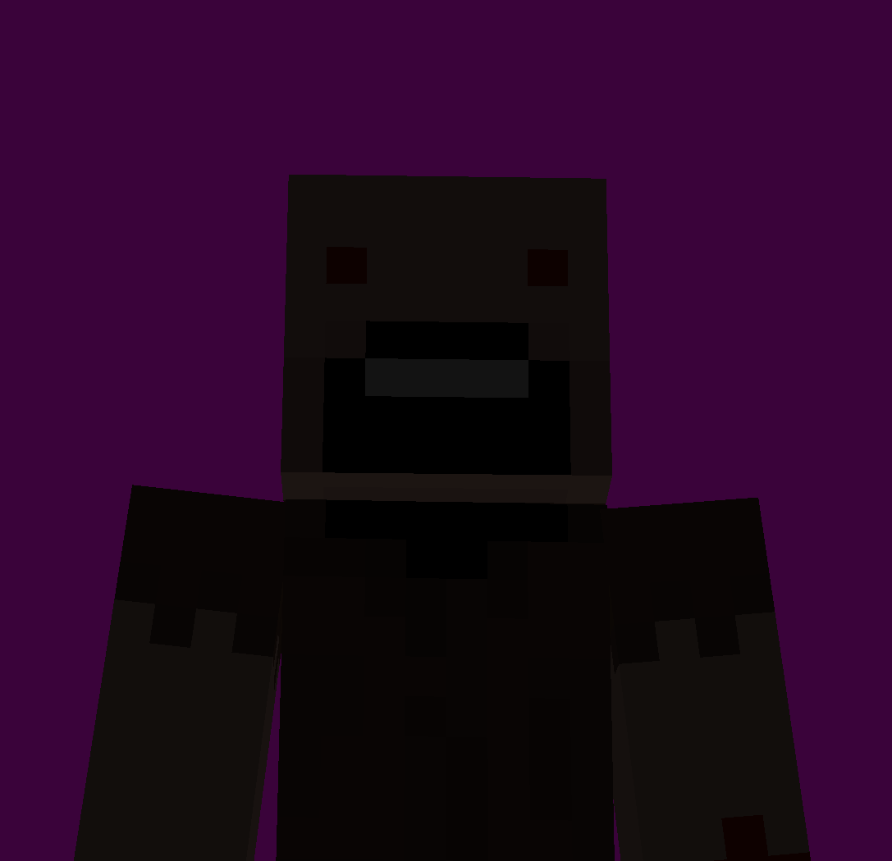 | 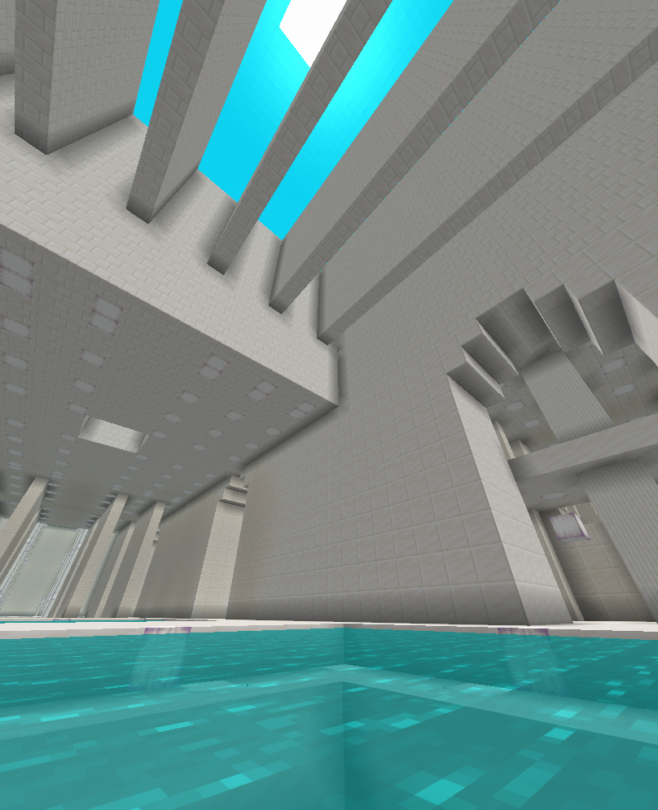 | 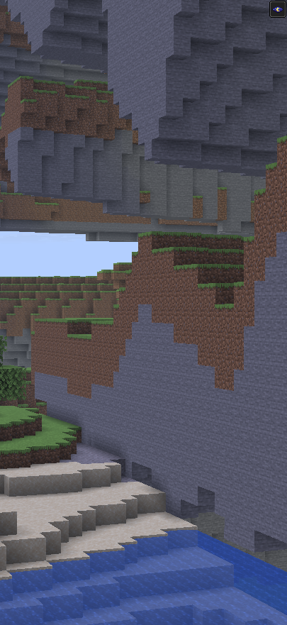 |
| 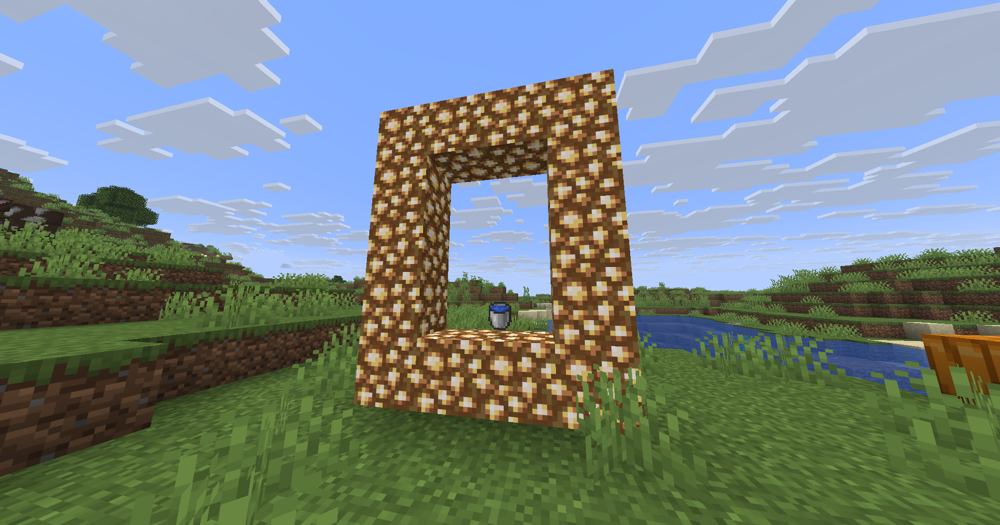 | 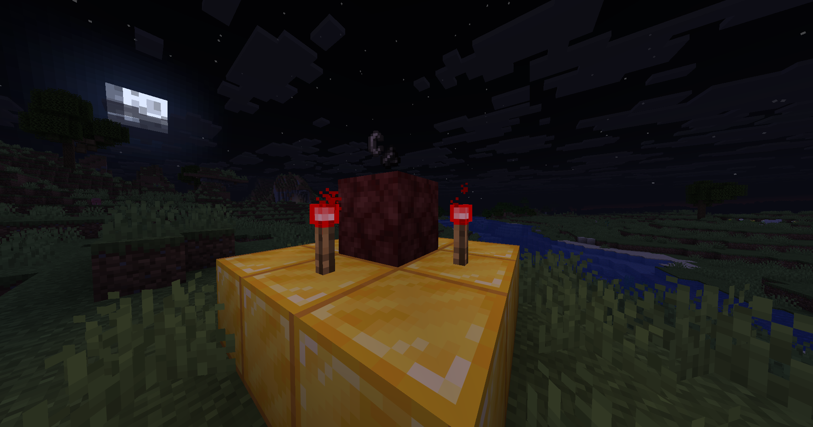 | 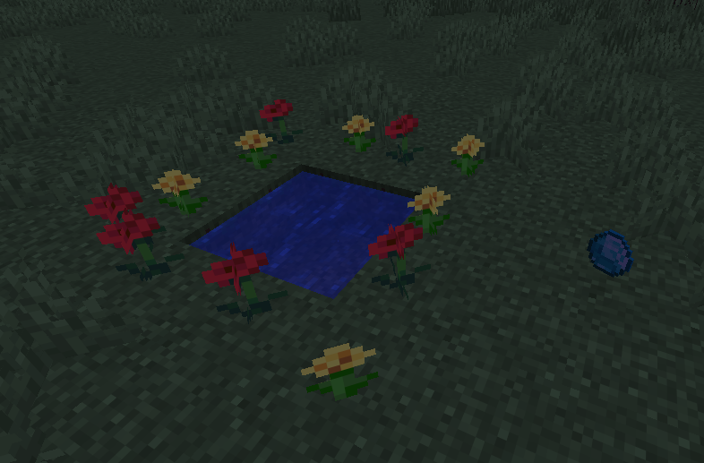 |

SPOILERS

This is an in-development survival horror plugin inspired by the [Backrooms](https://en.wikipedia.org/wiki/The_Backrooms) and minecraft "lore". It adds 11 unique levels, with more to come. Suggestions are welcome.

# THIS SOFTWARE IS IN PRE-ALPHA AND PROVIDED AS-IS

# SERIOUSLY, MAKE A BACKUP OF YOUR WORLD!

Jokes aside, this plugin may break your saves. I suggest using it on a fresh server and letting players discover things for themselves. it comes with an advancements system to give some hints and guidance. Feedback on the difficulty would be appreciated.

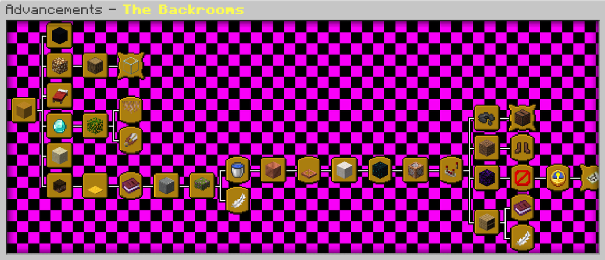

---

## Overview

A survival horror plugin for [Paper](https://papermc.io/) servers inspired by the [Backrooms](https://en.wikipedia.org/wiki/The_Backrooms) creepypasta and Minecraft community lore. Players are pulled out of normal gameplay through various triggers and dropped into a series of procedurally generated liminal levels. Each level has its own world generator, atmosphere, entities, and exit conditions. The plugin tracks per-player state, escalates difficulty over time, and includes a custom advancement tree.

**Status:** Pre-alpha. Expect bugs and breaking changes. Back up your world before installing.

## Levels

All level parameters (generation, events, entities, exits) are configurable in `levels/level_*.yml`.

| Level | Name | Screenshot | Description | Entry | Exit |
|-------|------|------------|-------------|-------|------|
| 0 | The Lobby |  | Infinite office space corridors lit by ochre froglights. The classic Backrooms. | Suffocation (16+ damage in blocks), Void Fall (below Y=-64), Herobrine Shrine  | Collect 7 written books → Level 1 |
| 1 | The Habitable Zone |  | Parking garage and warehouse vibes, corridors, overgrown garden patches. Gardens generate far from spawn and contain exits both above and below. | From Level 0 | Submerge in a garden pool → Level 2, Climb through a garden breach → Level 94 |
| 2 | The Pipe Works |  | Cramped industrial pipe networks. Small 1x1 tunnels (copper trapdoors) generate in ~1/20 eligible rooms, punching through the bedrock floor. | From Level 1 | Find and drop through a tunnel → Level 37 |
| 3 | The Server Room | 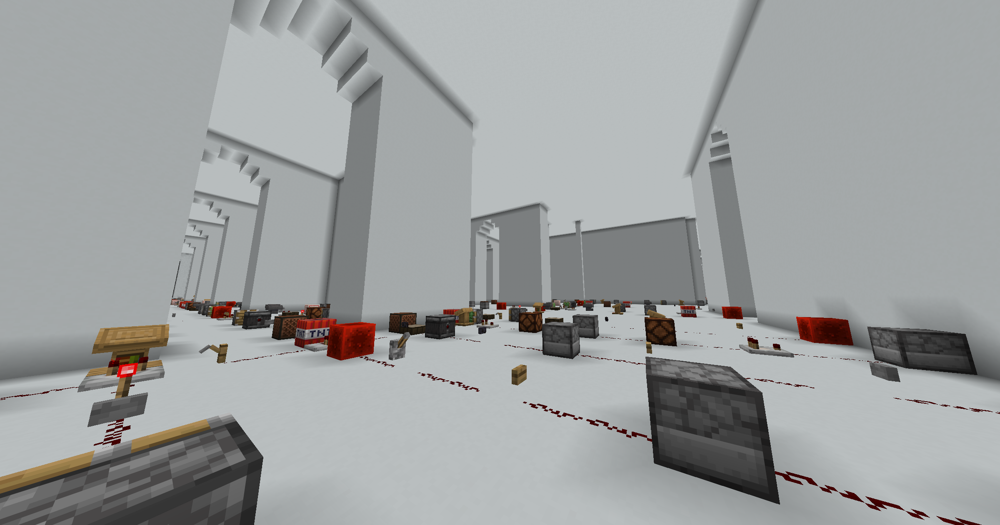 | Nonsensical redstone contraptions in fullbright white rooms. Hub level — four exits to different levels. Command blocks generate with lecterns on top containing cryptic hints about each destination. | From Level 37, Level 4, Level 84, Level 94 | Rapidly power the same command block many times (e.g. redstone clock) → Level 4, 5, 7, or 64637 depending on which block |
| 4 | The Far Lands | 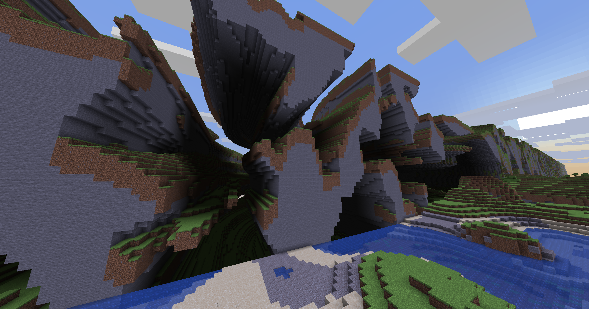 | Broken terrain simulating Minecraft's legacy coordinate overflow bug. Fixed at dusk. | From Level 3 | Walk 1000 blocks → Level 3 |
| 5 | Disc 11 |  | Dead-end level. An invisible pursuer follows you. Torches decay. | From Level 3 | Right-click a jukebox — it explodes and kills you (respawn in Level 0) |
| 7 | The Corrupted Chunk | 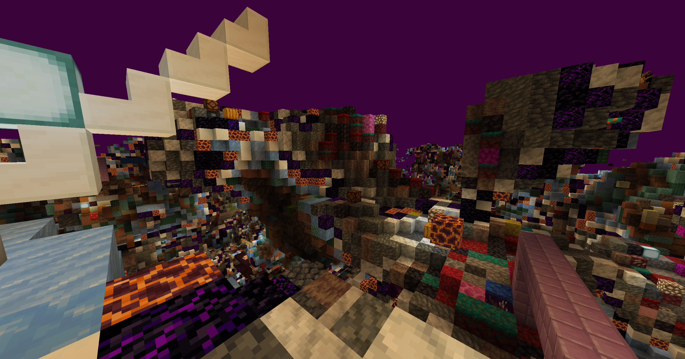 | Every block type at once, random structures everywhere. A giant Notch watches you. | From Level 3 | Fall below Y=0 → Overworld (escape) |
| 37 | The Poolrooms |  | Peaceful white pools with soft lighting. Multiple material palettes. A safe zone. Some pools are extra deep with a side drain that leads down. | From Level 2 | Find a drain and fall through → Level 3 |
| 64637 | The Library |  | Infinite bookshelves containing pre-written and procedurally generated books. | Bed Anomaly (5% chance during thunderstorm), from Level 3 | Collect 16 written books → Overworld (escape), Fall 200 blocks → Overworld (escape) |
| 84 | The Hedge Maze | 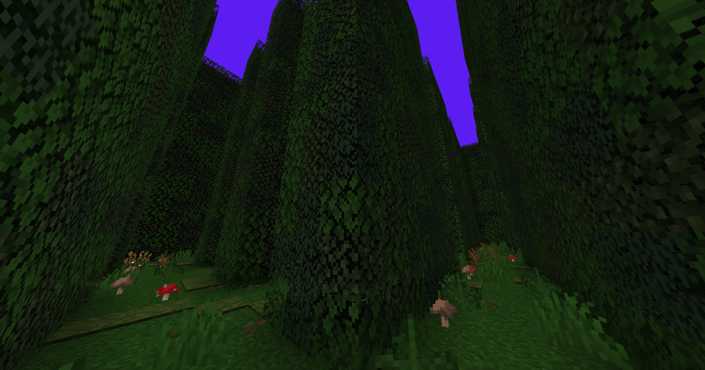 | A tall leaf-walled maze with poison punishment. Twilight sky. Bedrock holes generate at 200+ blocks from spawn (~1/60 chance per corridor cell). | Twilight Portal (flowers, throw diamond)  | Fall through a bedrock hole → Level 3, Climb above the walls → Level 94 |
| 94 | Skyblock | 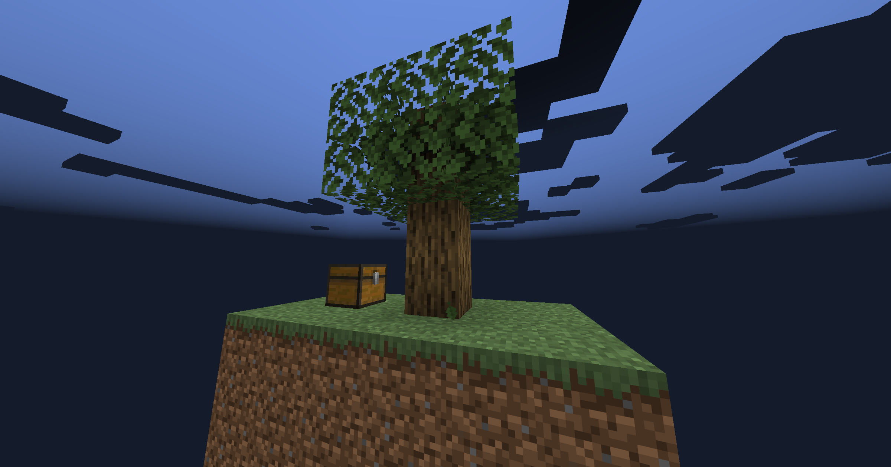 | A single floating island. Presented as a "reality breach" error. | "Aether" Portal (use water bucket)  Also from Level 1, from Level 84 | Bridge outward and left-click the invisible barrier wall. 

Spoiler
The barrier shatters in an expanding cascade revealing command blocks behind it. 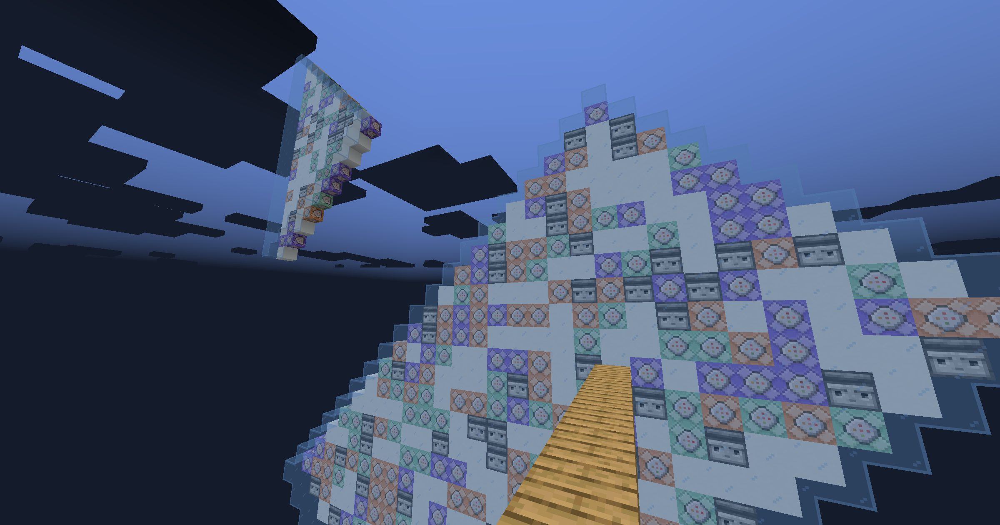 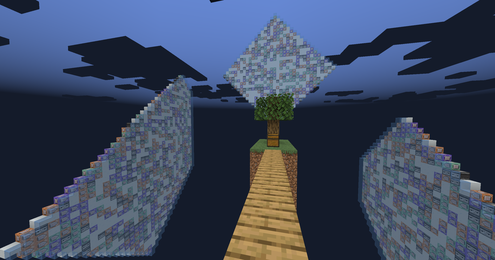
 → Level 3 |

On entry from the overworld, the player's return location is saved and can be restored with `/backrooms leave`.

## Entities

Entities are still WIP — more to come. They spawn around players at configurable distances and escalation thresholds. Each level's YAML file defines which entities appear, their skins, scale, behavior, spawn chance, and minimum escalation level.

**Entity types:**

| Type | Description |
|------|-------------|
| Mannequin | Fake player (Paper's `Mannequin` entity) with a configurable skin. Can use the target player's own skin. |
| Floating Head | An `ItemDisplay` showing a hovering player head that tracks the player. |
| Herobrine | Built-in white-eyed Steve. Appears across multiple levels. |
| Pursuer | Invisible. Manifests only as footstep sounds behind the player. Level 5 exclusive. |
| Wrong Enderman | A passive enderman that stares at you, never teleports, and makes you glow. Just unsettling. Level 4. |

**Behaviors** (assignable to mannequins and floating heads per-level):

| Behavior | Description |
|----------|-------------|
| Weeping Angel | Freezes when the player looks at it, advances when they look away. |
| Stalk | Slowly follows the player at a distance. |
| Attack | Charges at the player and deals configurable damage. |
| Flee | Runs away when the player looks at it. |
| Patrol | Wanders in random directions. |
| Stationary Stare | Stares at the player from a fixed position, despawns if approached. |

## Atmospheric Events & Escalation

Each level has configurable atmospheric events (ambient sounds, light flickering, blackouts, fake chat messages, footstep echoes, block corruption, inventory glitches, sign placement, and more). Events fire on randomized per-player timers with configurable intervals and chances. See `event_config` in each level's YAML for the full list and tuning parameters.

The plugin also tracks how long each player has spent in the Backrooms. As time increases, the escalation level rises (default thresholds: 5, 15, 30, 60, 120 minutes — configurable in `config.yml`). Each entity instance has a `min_escalation` requirement, so passive entities appear early while more aggressive ones only show up after the player has been trapped for a while.

## Commands & Permissions

### Commands

All commands are under `/backrooms`:

| Subcommand | Permission | Description |
|------------|------------|-------------|
| *(none)* | `backrooms.use` | Enter Level 0 |
| `leave` | `backrooms.use` | Exit to saved return location |
| `status` | `backrooms.use` | Show current level, escalation, and time |
| `goto <level>` | `backrooms.admin` | Teleport to a level |
| `enter <trigger>` | `backrooms.admin` | Fire an entry trigger directly |
| `event <id>` | `backrooms.admin` | Trigger an event immediately |
| `spawn <entity>` | `backrooms.admin` | Spawn an entity nearby |
| `despawn` | `backrooms.admin` | Despawn all nearby custom entities |
| `escalation [level]` | `backrooms.admin` | View or set escalation level |
| `reset` | `backrooms.admin` | Clear player Backrooms state |
| `list [level]` | `backrooms.admin` | List levels or entities in a level |
| `advance <id\|*>` | `backrooms.admin` | Grant advancements |
| `regenerate [world]` | `backrooms.regenerate` | Regenerate a Backrooms world |

### Permissions

| Permission | Default | Description |
|------------|---------|-------------|
| `backrooms.use` | true | Enter and leave the Backrooms |
| `backrooms.admin` | op | Admin commands |
| `backrooms.regenerate` | op | Regenerate worlds |
| `backrooms.reload` | op | Reload configuration |

## Configuration

### Main config (`config.yml`)

Controls global settings:
- **Entry triggers** — enable/disable each trigger, set damage thresholds, target levels, and trigger chances.
- **Entity spawner** — max entities per player (default 3), spawn check interval, min/max spawn distance.
- **Player** — death respawn level, escalation time thresholds.

### Per-level configs (`levels/level_*.yml`)

Each level has its own YAML file defining:
- World generator and generator-specific parameters (noise scales, material palettes, room dimensions).
- Environment (`NORMAL`, `NETHER`, `THE_END`), dimension type, and custom biome.
- Which events are active and their per-level tuning (chance, interval, sounds, messages).
- Entity instances with type, skin URL, scale, behavior, behavior parameters, spawn chance, and escalation gate.
- Exit triggers with target level and transition effects (blindness, nausea, darkness, delay, message).

All entity skins are referenced by Minecraft texture URL. The `player` skin keyword copies the target player's own skin.

## Advancements

The plugin registers a custom advancement tree via a bundled datapack. Advancements are granted for entering the Backrooms, visiting each level, and finding exits. They appear in the standard Minecraft advancements screen and serve as both progress tracking and hints.

